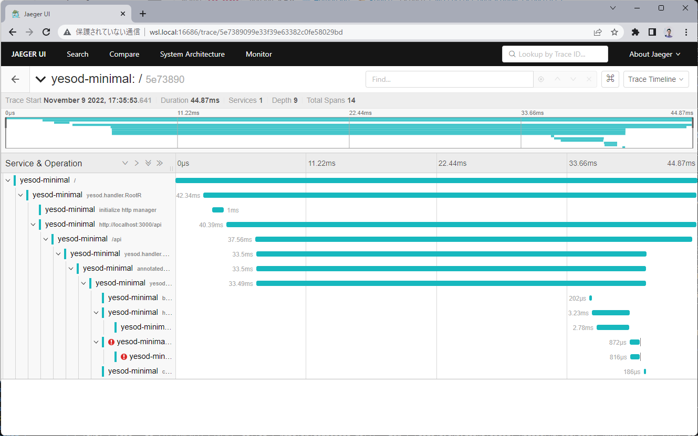

# yesod-minimal Example

## How to Run

Run a following command.

```
$ make server.run DOCKER_COMPOSE_OPTS=-d
$ make app.run
```

You can access following end points.

- http://localhost:16686/
  - Jaeger UI
- http://localhost:3000/
  - target app

For instance, when you access http://localhost:3000/, Open Telemetry's traces are sent to the Jaeger.
And you can watch the traces at http://localhost:16686.


